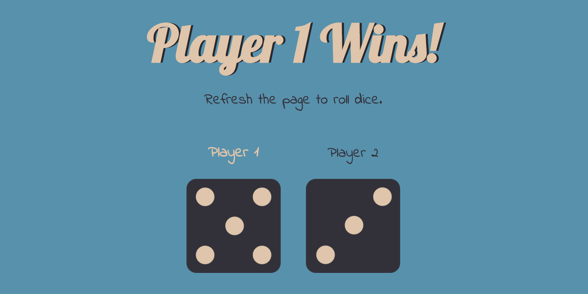

# Diceey  

  

This is an exercise while following the Udemy course "[The Complete 2019 Web Development Bootcamp](https://www.udemy.com/the-complete-web-development-bootcamp/)" by Dr. Angela Yu.  

There are two dice displayed via HTML, one for each player. Two random numbers are generated, one for each dice, and JavaScript is used to determine which dice image to display (depending on the random number value generated) after getting the appropriate elements and setting the appropriate attributes, as well as which player wins.  

The colors used come from [Color Hunt's color palette: 145355](https://colorhunt.co/palette/145355).  
The dice images were created by me in [Graphic for mac](https://www.graphic.com/), having the course lecture's dice images as a guide.  

The fonts used are "Indie Flower" and "Lobster" from [Google Fonts](https://fonts.google.com/).  

Refreshing the page causes a new 'roll' (two new random numbers generated).  

Possible outcomes are a win for the player that's rolled the highest number, or a draw if the random numbers are equal.  

---  

   

You can see it in action at: [https://dimitristsaknakis.github.io/diceey/](https://dimitristsaknakis.github.io/diceey/)  
